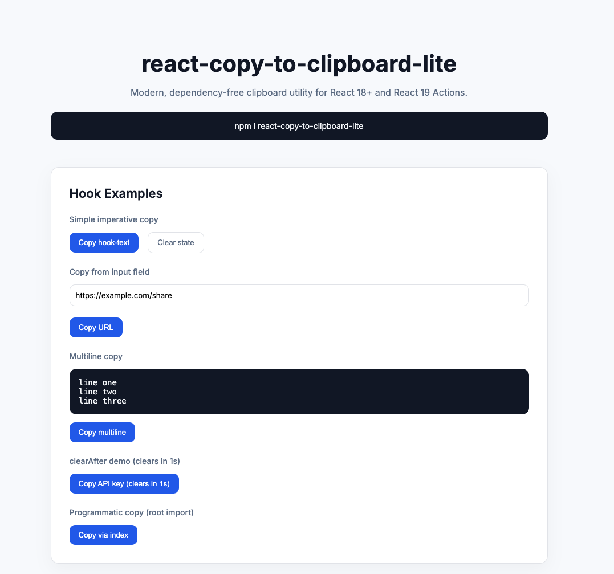

# react-copy-to-clipboard-lite

> Tiny, modern, dependency-free clipboard utility for React 18+  
> Secure. SSR-safe. Permission-aware. Fully tested. MIT.

[](https://github.com/rajudandigam/react-copy-to-clipboard-lite/actions)
[](https://bundlephobia.com/package/react-copy-to-clipboard-lite)
[](LICENSE)

---

## Why another clipboard library?

Most clipboard utilities:

- depend on legacy libraries
- use prompt() fallbacks
- are not SSR-safe
- lack structured error metadata
- don't support React 19 Actions
- ship unnecessary dependencies

**react-copy-to-clipboard-lite** is built for modern React apps:

- ✅ Zero runtime dependencies
- ✅ Tiered fallback (Clipboard API → execCommand)
- ✅ Structured `CopyResult` metadata
- ✅ Permission-aware (no prompting)
- ✅ React 19 `formAction` support
- ✅ Strict TypeScript
- ✅ Fully tested (Vitest + Playwright)
- ✅ Bundle size gated in CI
- ✅ Trusted npm publishing (OIDC)

---

## Installation

```bash
npm install react-copy-to-clipboard-lite
```

or

```bash
pnpm add react-copy-to-clipboard-lite
```

or

```bash
yarn add react-copy-to-clipboard-lite
```

Peer dependency:

```
react >= 18
```

---

## Core Usage (Framework Agnostic)

```ts
import { copyToClipboard } from "react-copy-to-clipboard-lite";

const result = await copyToClipboard("Hello world");

if (result.success) {
  console.log("Copied via:", result.method);
} else {
  console.log("Failed:", result.code);
}
```

---

## React Hook

```tsx
import { useCopyToClipboard } from "react-copy-to-clipboard-lite/react";

function Example() {
  const { copy, copied, error } = useCopyToClipboard({
    timeout: 1500,
    clearAfter: 1000,
  });

  return (
    <button onClick={() => copy("Secret API Key")}>
      {copied ? "Copied!" : "Copy"}
    </button>
  );
}
```

### What you get

- `copy(text)` → Promise<CopyResult>
- `copied` → auto-resets after timeout
- `error` → structured failure info
- `reset()` → manually reset state

---

## Component Wrapper

```tsx
import { CopyToClipboard } from "react-copy-to-clipboard-lite/react";

<CopyToClipboard
  text="Copy this value"
  onSuccess={() => console.log("Success")}
  onError={(r) => console.log(r.code)}
>
  <button>Copy</button>
</CopyToClipboard>
```

✔ Preserves your original `onClick`  
✔ Works with custom components  
✔ Works with spans, buttons, links  

---

## React 19 Action Support

```tsx
import { copyToClipboardAction } from "react-copy-to-clipboard-lite/react";

<form>
  <input name="text" defaultValue="Hello" />
  <button formAction={copyToClipboardAction}>
    Copy
  </button>
</form>
```

Fully compatible with:

- `useActionState`
- Server Components (client boundary required)
- Progressive enhancement

---

## Structured Result Metadata

```ts
type CopyResult = {
  success: boolean;
  method:
    | "clipboard-api"
    | "exec-command"
    | "unsupported"
    | "failed";
  code?:
    | "SECURITY_ERROR"
    | "PERMISSION_DENIED"
    | "INSECURE_CONTEXT"
    | "NO_BROWSER_SUPPORT"
    | "UNKNOWN";
  error?: unknown;
};
```

You always get a result object.  
It never throws.

---

## Secret Mode (clearAfter)

```ts
copyToClipboard("my-password", {
  clearAfter: 3000,
});
```

✔ Clears clipboard after X ms  
✔ Best-effort only  
✔ Never reads clipboard  
✔ Does not flip success if clear fails  

Great for password managers, API keys, tokens.

---

## Permission Awareness

- Uses `navigator.permissions.query()` when available
- Skips Clipboard API if denied
- Never prompts the user
- Falls back automatically

---

## SSR Safe

All browser APIs are accessed lazily inside functions.

Safe in:

- Next.js
- Remix
- Vite SSR
- Astro
- RSC environments

---

## Bundle Size

Designed to stay tiny.

CI enforces:

- `dist/index.mjs` < 2 KB
- `dist/react.mjs` < 3 KB

Measured with brotli compression.

---

## Browser Support

| Feature | Support |
|---------|---------|
| Async Clipboard API | Modern browsers |
| execCommand fallback | Safari / legacy |
| SSR guard | Yes |
| IE11 | ❌ Not supported |

No `prompt()` fallback.  
No clipboard-read.

---

## Real Demo Examples

**<a href="https://react-copy-to-clipboard-lite.vercel.app/" target="_blank" rel="noopener noreferrer">→ Live demo</a>**



The repository includes a full demo app covering:

- Imperative copy
- Copy from input
- Multiline text
- Temporary success UI
- clearAfter
- Custom components
- React 19 actions
- Error handling
- Fallback in insecure contexts

Run locally:

```bash
npm run dev:demo
```

---

## Architecture Overview

```
Clipboard API (secure)
        ↓
execCommand fallback
        ↓
Unsupported
```

Zero dependencies.  
Native TypeScript.  
Strict return contract.

Full architecture doc:
`docs/DEV-ARCHITECTURE.md`

---

## Testing & Quality

- ✅ 95%+ unit coverage (Vitest)
- ✅ Cross-browser E2E (Chromium, Firefox, WebKit)
- ✅ Bundle size gate
- ✅ Trusted Publishing (OIDC)
- ✅ Strict TS
- ✅ No side effects

---

## Comparison

| Feature | This Library | Typical Clipboard Lib |
|---------|--------------|------------------------|
| Zero dependencies | ✅ | ❌ |
| SSR safe | ✅ | ⚠️ |
| Structured result | ✅ | ❌ |
| React 19 Actions | ✅ | ❌ |
| Permission-aware | ✅ | ❌ |
| Size-gated CI | ✅ | ❌ |

---

## Migration

From older `react-copy-to-clipboard`:

```diff
- import { CopyToClipboard } from "react-copy-to-clipboard"
+ import { CopyToClipboard } from "react-copy-to-clipboard-lite/react"
```

Modernized.  
Typed.  
Smaller.

---

## Contributing

PRs welcome.

Before submitting:

```bash
npm run test:all
```

Must pass:

- Typecheck
- Unit tests
- Playwright
- Size limit

---

## License

MIT © Raju Dandigam
